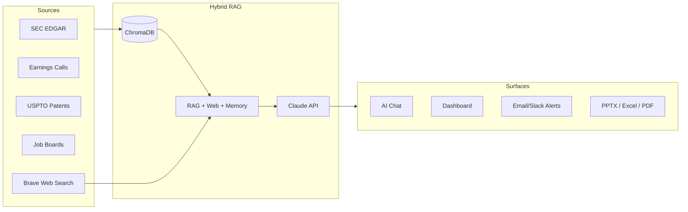
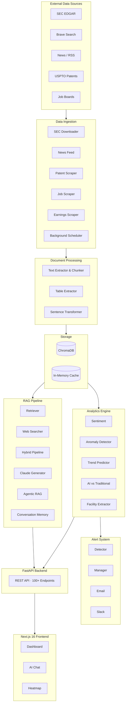

# Flex Competitive Intelligence Platform — AI-Powered CapEx Tracking

> An AI competitive-intelligence platform for **Flex Ltd.** that tracks how its top 4 contract-manufacturing competitors are spending capex on AI infrastructure — by ingesting 13 years of SEC filings, earnings calls, patents, and job postings, and surfacing the moves that matter through an AI chat + dashboard.

**405+ documents · 5 companies · 13 years (2022→2025) · 100+ API endpoints · ~$20–50/mo to operate**

> **Industry practicum** — built for a real client (Flex) over a 12-week capstone with a 4-person team at Santa Clara University.

---

## The Problem

Flex Ltd. is a top-3 global contract manufacturer (~$26 B revenue). Its competitors - Jabil, Celestica, Benchmark, Sanmina - are racing to win share of the **AI data-center build-out**, the largest capex cycle in the industry's history.

Flex's competitive intelligence team had three real pains:

1. **Information sprawl.** A typical signal — "Celestica announced a new SD-6300 server platform" — is buried across an 8-K filing, a press release, an earnings-call transcript, an OCP submission, and a job posting. No one tool combines them.
2. **Time-to-insight is too slow.** Junior analysts spend most of their week scraping and stitching documents instead of drawing conclusions. By the time a quarterly deck is ready, it's stale.
3. **No "ambient awareness."** When a competitor opens a new facility or files a patent, Flex finds out reactively. They needed a system that *pushes* alerts, not one that has to be queried.

> **Why now?** GenAI changed the math. RAG over a curated SEC + patents + jobs corpus + Claude can produce an analyst-grade brief in 30 seconds for the cost of a cup of coffee. Three years ago this would have been a 6-figure Bloomberg-style buildout.

---

## Users & Jobs-to-be-Done

| User | Job-to-be-Done | Today's Workaround | Why it is bad |
|------|----------------|--------------------|--------------|
| **CI Analyst (primary)** | When a competitor reports earnings, I want a one-page sentiment + capex delta brief in my inbox the same day. | Read 4 transcripts, copy numbers into Excel, color-code in PowerPoint | 2-day turnaround, error-prone, no historical baseline |
| **Strategy Director** | When my CEO asks "what's Celestica doing in AI?", I want to answer in one screen with citations. | Slack the analyst team and wait | Slow, no audit trail |
| **Investor Relations** | When peers report, I want to know how *our* commentary compares on tone and capex framing. | Manual side-by-side reading | Subjective, doesn't scale across 5 companies × 4 quarters/year |

---

## The Solution

A web app with two surfaces — **chat** ("ask any question, get a cited answer from the corpus") and **dashboard** ("see capex, sentiment, anomalies, geographic build-out at a glance") — backed by a hybrid RAG pipeline that combines a curated document store with live web search.



> Full system, data flow, and tech-stack diagrams live further down — the engineering depth is preserved.

### Key product decisions (and the tradeoffs)

| Decision | What we picked | What we rejected | Why |
|----------|----------------|------------------|-----|
| **Hybrid RAG (corpus + web)** | Combine ChromaDB results with live Brave Search in a single answer | Pure RAG over the SEC corpus | The CI team needs *fresh* signals (a press release from this morning isn't in any 10-K). Hybrid lets us serve "give me the latest" *and* "show me the historical baseline" from the same UI. |
| **Claude over OpenAI** | Anthropic Claude as the only LLM | GPT-4o, multi-LLM routing | One vendor → simpler bill, simpler ops, simpler eval. Claude's long-context window also lets us pass entire 10-K sections without chunking gymnastics. |
| **Bring-your-own data over a SaaS subscription** | We download SEC filings ourselves on a cron | Pay for FactSet / S&P Capital IQ | Free, defensible, customizable. The whole platform runs at $20–50/mo of API spend vs. the 5-figure subscriptions Flex is currently paying. **This is the headline ROI of the project.** |
| **Alerts as a first-class feature** | Background scheduler + email/Slack + alert manager | Dashboard-only ("come check") | The user job is *ambient awareness*. Pull-only dashboards lose. Pushing the 3 alerts that actually matter each week is the product. |
| **Three export formats** | Excel + PPTX + PDF as one-click downloads | Just web UI | The CI team's *output* is internal slides and briefs. Meeting them where they already work (PowerPoint) made the product immediately useful — no behavior change required. |
| **Geographic dimension** | Extract facility locations from filings → Leaflet heatmap | Skip — "it's all in the text anyway" | The AI build-out is spatial: it matters *where* hyperscale data centers are getting built. The map turned a hypothesis ("Celestica is concentrating in Thailand") into a visible pattern. |


---

## What stakeholder interviews actually changed

I ran structured discovery interviews with the Flex CI team — analysts, a strategy director, and the IR lead — at the start of the practicum and a second round at week 6 once we had a working prototype. Three of the most consequential product decisions came directly out of those conversations.

### What I expected vs. what I heard

| What I expected going in | What stakeholders actually said | How the product changed |
|---|---|---|
| **Analysts would live in the chat interface** — ask a question, get a cited answer, copy-paste into a deck. | **The deliverable is always a slide.** Senior analysts told us they wouldn't abandon their PowerPoint workflow — the chat is great for an ad-hoc question, but every external output ends up as a formatted brief. A tool that ignores that workflow gets ignored. | **PPTX export was promoted from P2 to P0** and got real engineering investment (templated slides per company, auto-pull of charts and citations). The product now feels like a feature *of* PowerPoint, not a separate destination. |
| **Real-time everything would win.** Live earnings-call streaming, live alert push, live anomaly tagging. | **"More signal, please" actually meant "less noise, please."** When we asked which alerts they'd want, the answer was consistently *fewer, better-ranked* — three a week that genuinely move a decision, not thirty a week they have to triage. | **Alert *ranking* became the core feature**, not alert *volume*. The roadmap's #1 P0 ("alert quality, not alert volume") came directly out of this. We deprioritized real-time streaming as a result. |
| **The SEC corpus would be the single source of truth** — once we had 13 years of 10-Ks and 10-Qs indexed, that would be enough. | **Press releases and trade-press coverage break first.** A new facility announcement shows up in a Yahoo Finance piece days or weeks before it appears in a filing. The CI team's job is to know first, and pure-RAG-over-SEC actively loses to a Google Alert on those questions. | **Hybrid RAG (corpus + live web search) became foundational**, not an add-on. Every chat answer can blend filings (for the historical baseline) with Brave Search results (for what just happened) in a single response, with citations from both. |

### The single most-cited pain

> *"It's not that we don't have the data. It's that compiling a comparable cross-company view takes me a day and a half — and by the time the deck is ready, the underlying numbers are already a quarter old."*
> — Senior CI Analyst (paraphrased composite of week-1 interviews)

The version of this pain that stuck with me most: **the work isn't research, it's reformatting.** The analysts knew the answers; what they didn't have was time. That re-anchored my mental model — the product wasn't replacing analyst judgment, it was eliminating the mechanical 80% so analyst judgment could happen on the remaining 20%.

### What this changed about how I prioritize

I came in thinking the moat was the AI quality. I left believing the moat was the **hand-off** — what the analyst does in the 90 seconds *after* they get the AI's answer. That reshaped our roadmap toward export polish, citation density, and "in-PowerPoint-able" formatting over headline LLM features. A slightly-worse model with a great hand-off beats a slightly-better model that drops you back into manual reformatting.

---

## Impact & Metrics

| Metric | Result | How measured |
|--------|--------|--------------|
| Document corpus | 405+ filings + transcripts + patents | Manifest at ingestion |
| Companies covered | Flex, Jabil, Celestica, Benchmark, Sanmina | Configured CIKs |
| API surface | 100+ REST endpoints across 18 route modules | FastAPI route count |
| Frontend pages | 16 pages (Dashboard, Chat, Companies, Compare, Sentiment, Heatmap, Alerts, Reports, ...) | App router |
| Operating cost | ~$20–50/mo (Claude API only; everything else free) | Anthropic billing |
| Demo readiness | Demoed end-to-end at Flex client meeting | — |

---

## What I'd Build Next

| Priority | Feature | Why this, why now |
|----------|---------|-------------------|
| **P0** | **Alert quality, not alert volume** | Today the system can detect anomalies; the next step is filtering to the 3 alerts/week that actually move a strategy decision. ML-ranked, with thumbs-up/thumbs-down feedback to learn analyst preferences. |
| **P0** | **"Ask my analyst" mode (agentic deep-dive)** | When an exec asks a hard question, the chat should *plan* (sub-questions → tool calls → synthesis) instead of one-shot RAG. The agentic scaffolding is already in the codebase; productizing it is the next quarter's work. |
| **P1** | **Earnings-call live mode** | During an earnings call, stream the transcript in, run sentiment + capex delta in real time, push alerts to the CI Slack as the call happens. Owns the most valuable 60 minutes of CI work. |
| **P1** | **Self-serve company onboarding** | Add a new ticker → system bootstraps the corpus. Turns this from a "Flex tool" into a "CI platform" — much bigger market. |
| **P2** | **Analyst-network annotations** | Let analysts annotate filings ("this is a major change in capex framing") and use those as training signal for the anomaly detector. Closes the human-in-the-loop. |

**What I would NOT build next:** A general-purpose financial chatbot. The defensible moat here is *being opinionated about the contract-manufacturing industry* — not being another generic FinanceGPT.


---

## Hard decisions: what we cut from the roadmap (and why)

> *Every "yes" on this project meant a "no" somewhere else. The cuts are the most defensible part of the design.*

### Cut 1: Real-time earnings-call streaming

- **What it was:** Stream the live earnings-call audio in (via a transcription service), run incremental sentiment + capex-mention detection on the partial transcript as the call unfolded, and push timestamped alerts to Slack within seconds of an executive saying something material.
- **Why it was tempting:** The earnings call is the single most-watched 60 minutes in CI work. A tool that reduced "what did they just say about AI capex?" from a 2-day post-call analysis to a live notification would have been a marquee demo feature.
- **Why we cut it:** Three reasons compounded. **(1) Cost stack:** a transcription API + extra model calls per minute would have pushed the per-call run cost into double digits, breaking the "$20–50/mo" cost story which was the actual headline of the project. **(2) Stakeholder priority:** when we re-checked at week 6, only 2 of 5 stakeholders ranked it in their top 3 — the analysts cared more about *next-morning brief quality* than *during-call alerts*. **(3) Engineering surface:** real-time anything required a streaming pipeline, latency monitoring, and an entirely new failure mode (what if the transcript is wrong?). For a 4-person team on a 12-week clock, the complexity tax wasn't worth it.
- **What we'd need to revisit it:** A specific stakeholder request from an exec who actually trades on the call (IR or CFO-adjacent), plus a Claude pricing change that drops streaming-eligible costs by ~70%.

### Cut 2: Multi-LLM model routing

- **What it was:** Letting the system route different question types to different LLMs — Claude for long-context summaries, GPT-4o for structured extraction, Gemini for cheap classification.
- **Why it was tempting:** Cost optimization (~30–40% cheaper at scale) and the chance to A/B model performance on different tasks.
- **Why we cut it:** Three vendors meant three rate limits, three eval pipelines, three SDK abstractions, and a routing layer to maintain. For a 4-person team on a 12-week clock, the *complexity tax* exceeded the cost savings. Picking one strong general-purpose model (Claude) made the whole system shippable.
- **What we'd need to revisit it:** Sustained monthly Claude bills above ~$500. At our $20–50/mo, the optimization is mathematically pointless.

### Cut 3: A native mobile app

- **What it was:** A native iOS / Android app that mirrored the dashboard so analysts could check capex anomalies and read alerts from their phones during travel, on the train, etc.
- **Why we cut it:** We checked the assumption first — and the CI team consistently does deep work on a desktop, with multiple monitors, in long uninterrupted sessions. The mobile use case was *checking one alert*, which Slack and email already serve. Building a mobile app for a duplicate of an existing surface would have eaten weeks of frontend time to win zero net workflows. The web app is responsive enough to read alerts on a phone, which covers the actual mobile job.
- **What we'd need to revisit it:** Telemetry showing > 30% of alert-clickthroughs happening on mobile devices over a sustained period (right now: ~0%, because the audience is primarily on desktop).

### What this signals about how I make tradeoffs

I'd rather ship one boring feature fully done than three exciting features half-done. The **complexity tax** of additional surfaces — extra deploy targets, extra failure modes, extra eval pipelines — is the most consistently underestimated cost in product work. Each of these cuts came down to the same question: *"is the marginal user-job we'd unlock worth the complexity it adds to everything else?"* When the answer was no, we said no out loud and wrote the reason down — that's what makes the cuts defensible later.

---

## My Role

This was a **4-person team, 12-week practicum** for **Flex Ltd.** at Santa Clara University. Title: *Strategic Analytics Consultant.*

> **A note on the language stats:** GitHub shows this repo as "99% HTML." That's because the 188 MB of HTML is **downloaded SEC filings**, not authored code. The actual codebase is **~593 KB of Python** (backend, RAG pipeline, ingestion, analytics) and **~315 KB of TypeScript** (Next.js frontend). I've added a `.gitattributes` to vendor those data files so the language bar reflects what was actually written.

### Product & strategy work I owned

- **Stakeholder discovery** — Ran structured interviews with the Flex CI team (analysts, strategy director, IR lead). Wrote the persona doc (CI Analyst as primary, Strategy Director as decider, IR as secondary). See *"What stakeholder interviews actually changed"* above.
- **Roadmap & prioritization** — Owned the spec, the cut list (see *"Hard decisions"* above), and the Now / Next / Later framework that kept 4 people on 12 weeks shipping a demo-able product instead of half a dozen half-finished features.
- **The cost-coverage decision** — Pushed the team away from paid APIs (FactSet, S&P Capital IQ) toward free public sources (SEC EDGAR, USPTO PatentsView, Brave Search). This is the line that lands hardest in the client demo — *5-figure SaaS replaced by ~$30/mo* — and it was a contested call internally.
- **Demo narrative & client presentation** — Wrote the storyboard, the executive 1-pager, and delivered the live walk-through at the client meeting.

### Code I personally wrote (or led)

The repo is a 4-person codebase. To be clear about what's mine vs. the team's:

| Module | My contribution | Evidence in commit history |
|---|---|---|
| `Vector Database/build_chromadb.py` | **Lead author** — the embedding pipeline that turns the SEC corpus into ChromaDB collections. Integrated 4 teammates' extraction improvements. | `Integrate Person 1/2/4 extraction improvements into build_chromadb.py` (Feb 23) |
| `backend/rag/retriever.py` (recency logic) | **Wrote** — the recency-boost and "filter to top 3 fiscal years" features that fixed the system's tendency to surface stale 2022 filings when users asked for "the latest." | `Fix recency: filter to top 3 fiscal years for recent/latest queries` and `Increase recency boost from +0.10 to +0.25 for latest/recent queries` (Feb 27) |
| `backend/ingestion/processor.py` (chunker tuning) | **Wrote** — tuned chunk-overlap from 25 → 50 words after observing context loss across chunk boundaries on multi-paragraph capex disclosures. | `Increase chunk overlap from 25 to 50 words` (Feb 23) |
| `backend/main.py` startup wiring | **Debugged + fixed** — caught two empty-file bugs (`pipeline.py`, `processor.py`) that were preventing backend startup after a teammate's merge. | `Fix empty pipeline.py and processor.py that prevented backend startup` (Feb 23) |
| `backend/api/routes/chat.py` | **Co-author** with teammate — wrote the streaming response handler and session memory wiring. | `Fix empty chat page and API client` (Feb 23) |
| `SETUP.md` + `README.md` | **Sole author** — the docs that let new teammates and the client run the system end-to-end. | `Update README to reflect actual codebase architecture`, `Fix outdated path reference in SETUP.md` |
| Per-company rebuild script | **Wrote** — script that rebuilds ChromaDB collections one company at a time, fixing OOM crashes during full-corpus rebuilds. | `Add per-company rebuild script and fix build memory issues` (Feb 27) |

### What teammates owned

- **Frontend** (Next.js 16 dashboard, Leaflet heatmap, all 16 pages) — primarily one teammate.
- **Ingestion scrapers** (`backend/ingestion/sec_downloader.py`, `patent_scraper.py`, `job_scraper.py`, `news_aggregator.py`) — primarily two teammates (referred to as "Person 1" and "Person 2" in my integration commits).
- **Alerts + Exports** (`backend/alerts/`, `backend/exports/`) — primarily one teammate.

---

## What I Learned

- **The cost story is the product story.** The most powerful slide in the client demo wasn't the AI chat — it was "$20–50/mo replaces $50K+/yr." For an enterprise B2B tool, ROI is the headline; intelligence is the feature.
- **Pull-only dashboards lose.** The CI team has more data than time. The unlock was inverting the model — *push* the 3 things that matter — which moved the product from "another tab" to "in their workflow."
- **Hybrid RAG (corpus + web) handles a real product gap.** Pure RAG can't answer "what just happened?" Pure web search can't answer "how does this compare to 2022?" The synthesis is where the user actually lives.
- **Practicum work needs PM rigor.** With 4 people for 12 weeks, you can build everything *or* the right thing. Having a written spec and a "what we are NOT doing" list was what got us to a demo-able product instead of a half-finished one.

---

## Tech Stack

| Layer | Technology | Cost |
|-------|------------|------|
| Vector DB | ChromaDB | Free |
| Embeddings | sentence-transformers `all-mpnet-base-v2` (768-dim) | Free |
| LLM | Anthropic Claude API | ~$20–50/mo |
| Web Search | Brave Search API | Free tier |
| SEC Data | SEC EDGAR API + custom downloader | Free |
| Patents | USPTO PatentsView | Free |
| Jobs | Web scraping | Free |
| Scheduler | APScheduler | Free |
| Backend | FastAPI (async) | Free |
| Frontend | Next.js 16, Tailwind v4, shadcn/ui, Recharts, Leaflet | Free |
| Exports | python-pptx, openpyxl, WeasyPrint | Free |
| **Total** | | **~$20–50/mo** |

---

## System Architecture



---

## Quick Start

```bash
git clone https://github.com/sjagannathan17/flex-competitive-intelligence.git
cd flex-competitive-intelligence

# API keys
cp backend/.env.example backend/.env
# Edit backend/.env with your Anthropic + Brave API keys

# Frontend env
echo "NEXT_PUBLIC_API_URL=http://localhost:8001" > frontend/.env.local

# Install
pip install -r backend/requirements.txt
cd frontend && npm install && cd ..

# Run (two terminals)
python3 -m uvicorn backend.main:app --host 0.0.0.0 --port 8001
cd frontend && npm run dev
```

App: `http://localhost:3000` · API docs: `http://localhost:8001/docs`
See [SETUP.md](SETUP.md) for prerequisites + troubleshooting.

---

## API Surface (100+ endpoints)

Full interactive docs at `http://localhost:8001/docs`. Highlights:

| Group | Examples |
|-------|----------|
| Chat | `POST /api/chat`, `POST /api/chat/stream`, sessions + history |
| Companies | `/api/companies`, `/api/companies/{ticker}`, `/api/companies/compare/{tickers}` |
| Analysis | `/api/analysis/capex`, `/api/analysis/ai-investments`, `/api/analytics/anomalies` |
| Sentiment | `/api/sentiment/company/{name}`, `/api/sentiment/compare`, `/api/sentiment/trend/{name}` |
| Geographic | `/api/geographic/facilities`, `/api/geographic/heatmap` |
| Patents/Jobs/OCP | `/api/patents/{company}`, `/api/jobs/{company}`, `/api/ocp/{company}` |
| Exports | `/api/exports/excel/{company}`, `/api/exports/powerpoint/{company}`, `/api/exports/pdf/{company}` |
| Alerts | `/api/alerts`, `/api/alerts/check`, `/api/alerts/summary` |

Companies tracked (CIKs): Flex (`0000866374`), Jabil (`0000898293`), Celestica (`0001030894`), Benchmark (`0001080020`), Sanmina (`0000897723`).

---

## Repo Structure

```
Flex-Practicum-Project-2026/
├── backend/ # FastAPI backend
│ ├── main.py # App entry + route registration
│ ├── core/ # config, db (ChromaDB), cache
│ ├── rag/ # retriever, generator, web_search, pipeline, agentic, memory
│ ├── ingestion/ # SEC, earnings, patents, jobs, news, OCP, scheduler
│ ├── analytics/ # sentiment, anomaly, trends, classifier, facility extractor
│ ├── alerts/ # detector, manager, email, slack
│ ├── exports/ # excel, powerpoint, pdf
│ ├── reports/ # auto-summarizer, calendar, scheduler
│ └── api/routes/ # 18 route modules, 100+ endpoints
├── frontend/ # Next.js 16 (16 pages, App Router)
├── Vector Database/ # build_chromadb.py
├── chromadb_store/ # Built locally, not in git
├── data/ # Downloaded data
├── Flex/ Jabil/ Celestica/ benchmark/ Sanmina/ # Per-company source filings
├── SETUP.md
└── README.md
```

---

## License

Educational and research use only. Built for the Santa Clara University Practicum program.

---

**Built by [Srinidhi Jagannathan](https://github.com/sjagannathan17)** + 3 teammates · [Portfolio](https://sjagannathan17.github.io/portfolio) · [LinkedIn](https://linkedin.com/in/srinidhi-jagannathan) · srinidhi.jagan11@gmail.com
