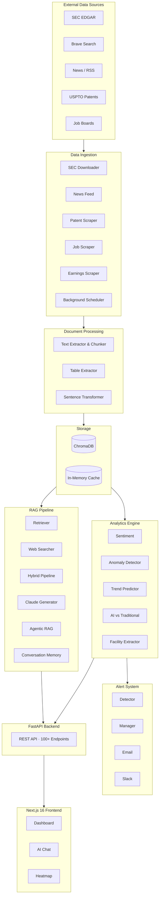

# Flex Competitive Intelligence Platform — AI-Powered CapEx Tracking

> An AI competitive-intelligence platform for **Flex Ltd.** that tracks how its top 4 contract-manufacturing competitors are spending capex on AI infrastructure — by ingesting 13 years of SEC filings, earnings calls, patents, and job postings, and surfacing the moves that matter through an AI chat + dashboard.

**405+ documents · 5 companies · 13 years (2022→2025) · 100+ API endpoints · ~$20–50/mo to operate**

> **Industry practicum** — built for a real client (Flex) over a 12-week capstone with a 4-person team at Santa Clara University.

---

## The Problem

Flex Ltd. is a top-3 global contract manufacturer (~$26 B revenue). Its competitors — Jabil, Celestica, Benchmark, Sanmina — are racing to win share of the **AI data-center build-out**, the largest capex cycle in the industry's history.

Flex's competitive intelligence team had three real pains:

1. **Information sprawl.** A typical signal — "Celestica announced a new SD-6300 server platform" — is buried across an 8-K filing, a press release, an earnings-call transcript, an OCP submission, and a job posting. No one tool combines them.
2. **Time-to-insight is too slow.** Junior analysts spend most of their week scraping and stitching documents instead of drawing conclusions. By the time a quarterly deck is ready, it's stale.
3. **No "ambient awareness."** When a competitor opens a new facility or files a patent, Flex finds out reactively. They needed a system that *pushes* alerts, not one that has to be queried.

> **Why now?** GenAI changed the math. RAG over a curated SEC + patents + jobs corpus + Claude can produce an analyst-grade brief in 30 seconds for the cost of a cup of coffee. Three years ago this would have been a 6-figure Bloomberg-style buildout.

---

## Users & Jobs-to-be-Done

| User | Job-to-be-Done | Today's Workaround | Why it sucks |
|------|----------------|--------------------|--------------|
| **CI Analyst (primary)** | When a competitor reports earnings, I want a one-page sentiment + capex delta brief in my inbox the same day. | Read 4 transcripts, copy numbers into Excel, color-code in PowerPoint | 2-day turnaround, error-prone, no historical baseline |
| **Strategy Director** | When my CEO asks "what's Celestica doing in AI?", I want to answer in one screen with citations. | Slack the analyst team and wait | Slow, no audit trail |
| **Investor Relations** | When peers report, I want to know how *our* commentary compares on tone and capex framing. | Manual side-by-side reading | Subjective, doesn't scale across 5 companies × 4 quarters/year |

---

## The Solution

A web app with two surfaces — **chat** ("ask any question, get a cited answer from the corpus") and **dashboard** ("see capex, sentiment, anomalies, geographic build-out at a glance") — backed by a hybrid RAG pipeline that combines a curated document store with live web search.

```mermaid
flowchart LR
    subgraph Sources[ Sources]
      SEC[SEC EDGAR]
      EC[Earnings Calls]
      PAT[USPTO Patents]
      JOBS[Job Boards]
      WEB[Brave Web Search]
    end

    subgraph Pipeline[ Hybrid RAG]
      ChromaDB[(ChromaDB)]
      Claude[Claude API]
      Pipeline[RAG + Web + Memory]
    end

    subgraph Surfaces[ Surfaces]
      Chat[AI Chat]
      Dash[Dashboard]
      Alerts[Email/Slack Alerts]
      Exports[PPTX / Excel / PDF]
    end

    Sources --> ChromaDB --> Pipeline --> Claude --> Surfaces
    WEB --> Pipeline
```

> Full system, data flow, and tech-stack diagrams live further down — the engineering depth is preserved.

### Key product decisions (and the tradeoffs)

| Decision | What we picked | What we rejected | Why |
|----------|----------------|------------------|-----|
| **Hybrid RAG (corpus + web)** | Combine ChromaDB results with live Brave Search in a single answer | Pure RAG over the SEC corpus | The CI team needs *fresh* signals (a press release from this morning isn't in any 10-K). Hybrid lets us serve "give me the latest" *and* "show me the historical baseline" from the same UI. |
| **Claude over OpenAI** | Anthropic Claude as the only LLM | GPT-4o, multi-LLM routing | One vendor → simpler bill, simpler ops, simpler eval. Claude's long-context window also lets us pass entire 10-K sections without chunking gymnastics. |
| **Bring-your-own data over a SaaS subscription** | We download SEC filings ourselves on a cron | Pay for FactSet / S&P Capital IQ | Free, defensible, customizable. The whole platform runs at $20–50/mo of API spend vs. the 5-figure subscriptions Flex is currently paying. **This is the headline ROI of the project.** |
| **Alerts as a first-class feature** | Background scheduler + email/Slack + alert manager | Dashboard-only ("come check") | The user job is *ambient awareness*. Pull-only dashboards lose. Pushing the 3 alerts that actually matter each week is the product. |
| **Three export formats** | Excel + PPTX + PDF as one-click downloads | Just web UI | The CI team's *output* is internal slides and briefs. Meeting them where they already work (PowerPoint) made the product immediately useful — no behavior change required. |
| **Geographic dimension** | Extract facility locations from filings → Leaflet heatmap | Skip — "it's all in the text anyway" | The AI build-out is spatial: it matters *where* hyperscale data centers are getting built. The map turned a hypothesis ("Celestica is concentrating in Thailand") into a visible pattern. |

---

## Impact & Metrics

| Metric | Result | How measured |
|--------|--------|--------------|
| Document corpus | 405+ filings + transcripts + patents | Manifest at ingestion |
| Companies covered | Flex, Jabil, Celestica, Benchmark, Sanmina | Configured CIKs |
| API surface | 100+ REST endpoints across 18 route modules | FastAPI route count |
| Frontend pages | 16 pages (Dashboard, Chat, Companies, Compare, Sentiment, Heatmap, Alerts, Reports, ...) | App router |
| Operating cost | ~$20–50/mo (Claude API only; everything else free) | Anthropic billing |
| Demo readiness | Demoed end-to-end at Flex client meeting | — |

**Qualitative wins:**
- Project sponsored by Flex Ltd. as part of the SCU Practicum program — real client, real feedback.
- The *cost story* (5-figure SaaS replaced by ~$30/mo) is the line that lands hardest with executives.

---

## What I'd Build Next

| Priority | Feature | Why this, why now |
|----------|---------|-------------------|
| **P0** | **Alert quality, not alert volume** | Today the system can detect anomalies; the next step is filtering to the 3 alerts/week that actually move a strategy decision. ML-ranked, with thumbs-up/thumbs-down feedback to learn analyst preferences. |
| **P0** | **"Ask my analyst" mode (agentic deep-dive)** | When an exec asks a hard question, the chat should *plan* (sub-questions → tool calls → synthesis) instead of one-shot RAG. The agentic scaffolding is already in the codebase; productizing it is the next quarter's work. |
| **P1** | **Earnings-call live mode** | During an earnings call, stream the transcript in, run sentiment + capex delta in real time, push alerts to the CI Slack as the call happens. Owns the most valuable 60 minutes of CI work. |
| **P1** | **Self-serve company onboarding** | Add a new ticker → system bootstraps the corpus. Turns this from a "Flex tool" into a "CI platform" — much bigger market. |
| **P2** | **Analyst-network annotations** | Let analysts annotate filings ("this is a major change in capex framing") and use those as training signal for the anomaly detector. Closes the human-in-the-loop. |

**What I would NOT build next:** A general-purpose financial chatbot. The defensible moat here is *being opinionated about the contract-manufacturing industry* — not being another generic FinanceGPT.

---

## My Role

This was a **4-person team, 12-week practicum** for **Flex Ltd.** at Santa Clara University.

**What I personally owned:**
- Stakeholder interviews with the Flex CI team — translated their needs into the product spec
- Owned the *CI Analyst* persona work and the prioritization framework that became the dashboard / alerts roadmap
- Drove the cost-vs-coverage decision (free SEC scraper + Claude + free OSS stack vs. paid APIs)
- Documentation, demo narrative, and the client-facing presentation
- Co-built the RAG pipeline and sentiment analyzer modules

**What teammates owned:**
- Frontend (Next.js, dashboard, heatmap)
- Ingestion pipeline (SEC, USPTO, jobs, OCP scrapers)
- Alert + export systems

---

## What I Learned

- **The cost story is the product story.** The most powerful slide in the client demo wasn't the AI chat — it was "$20–50/mo replaces $50K+/yr." For an enterprise B2B tool, ROI is the headline; intelligence is the feature.
- **Pull-only dashboards lose.** The CI team has more data than time. The unlock was inverting the model — *push* the 3 things that matter — which moved the product from "another tab" to "in their workflow."
- **Hybrid RAG (corpus + web) handles a real product gap.** Pure RAG can't answer "what just happened?" Pure web search can't answer "how does this compare to 2022?" The synthesis is where the user actually lives.
- **Practicum work needs PM rigor.** With 4 people for 12 weeks, you can build everything *or* the right thing. Having a written spec and a "what we are NOT doing" list was what got us to a demo-able product instead of a half-finished one.

---

## Tech Stack

| Layer | Technology | Cost |
|-------|------------|------|
| Vector DB | ChromaDB | Free |
| Embeddings | sentence-transformers `all-mpnet-base-v2` (768-dim) | Free |
| LLM | Anthropic Claude API | ~$20–50/mo |
| Web Search | Brave Search API | Free tier |
| SEC Data | SEC EDGAR API + custom downloader | Free |
| Patents | USPTO PatentsView | Free |
| Jobs | Web scraping | Free |
| Scheduler | APScheduler | Free |
| Backend | FastAPI (async) | Free |
| Frontend | Next.js 16, Tailwind v4, shadcn/ui, Recharts, Leaflet | Free |
| Exports | python-pptx, openpyxl, WeasyPrint | Free |
| **Total** | | **~$20–50/mo** |

---

## System Architecture



---

## Quick Start

```bash
git clone https://github.com/sjagannathan17/Flex-Practicum-Project-2026.git
cd Flex-Practicum-Project-2026

# API keys
cp backend/.env.example backend/.env
# Edit backend/.env with your Anthropic + Brave API keys

# Frontend env
echo "NEXT_PUBLIC_API_URL=http://localhost:8001" > frontend/.env.local

# Install
pip install -r backend/requirements.txt
cd frontend && npm install && cd ..

# Run (two terminals)
python3 -m uvicorn backend.main:app --host 0.0.0.0 --port 8001
cd frontend && npm run dev
```

App: `http://localhost:3000` · API docs: `http://localhost:8001/docs`
See [SETUP.md](SETUP.md) for prerequisites + troubleshooting.

---

## API Surface (100+ endpoints)

Full interactive docs at `http://localhost:8001/docs`. Highlights:

| Group | Examples |
|-------|----------|
| Chat | `POST /api/chat`, `POST /api/chat/stream`, sessions + history |
| Companies | `/api/companies`, `/api/companies/{ticker}`, `/api/companies/compare/{tickers}` |
| Analysis | `/api/analysis/capex`, `/api/analysis/ai-investments`, `/api/analytics/anomalies` |
| Sentiment | `/api/sentiment/company/{name}`, `/api/sentiment/compare`, `/api/sentiment/trend/{name}` |
| Geographic | `/api/geographic/facilities`, `/api/geographic/heatmap` |
| Patents/Jobs/OCP | `/api/patents/{company}`, `/api/jobs/{company}`, `/api/ocp/{company}` |
| Exports | `/api/exports/excel/{company}`, `/api/exports/powerpoint/{company}`, `/api/exports/pdf/{company}` |
| Alerts | `/api/alerts`, `/api/alerts/check`, `/api/alerts/summary` |

Companies tracked (CIKs): Flex (`0000866374`), Jabil (`0000898293`), Celestica (`0001030894`), Benchmark (`0001080020`), Sanmina (`0000897723`).

---

## Repo Structure

```
Flex-Practicum-Project-2026/
├── backend/ # FastAPI backend
│ ├── main.py # App entry + route registration
│ ├── core/ # config, db (ChromaDB), cache
│ ├── rag/ # retriever, generator, web_search, pipeline, agentic, memory
│ ├── ingestion/ # SEC, earnings, patents, jobs, news, OCP, scheduler
│ ├── analytics/ # sentiment, anomaly, trends, classifier, facility extractor
│ ├── alerts/ # detector, manager, email, slack
│ ├── exports/ # excel, powerpoint, pdf
│ ├── reports/ # auto-summarizer, calendar, scheduler
│ └── api/routes/ # 18 route modules, 100+ endpoints
├── frontend/ # Next.js 16 (16 pages, App Router)
├── Vector Database/ # build_chromadb.py
├── chromadb_store/ # Built locally, not in git
├── data/ # Downloaded data
├── Flex/ Jabil/ Celestica/ benchmark/ Sanmina/ # Per-company source filings
├── SETUP.md
└── README.md
```

---

## License

Educational and research use only. Built for the Santa Clara University Practicum program.

---

**Built by [Srinidhi Jagannathan](https://github.com/sjagannathan17)** + 3 teammates · [Portfolio](https://portfolio-pi-olive-yfvgxx81kp.vercel.app) · [LinkedIn](https://linkedin.com/in/srinidhi-jagannathan) · srinidhi.jagan11@gmail.com
